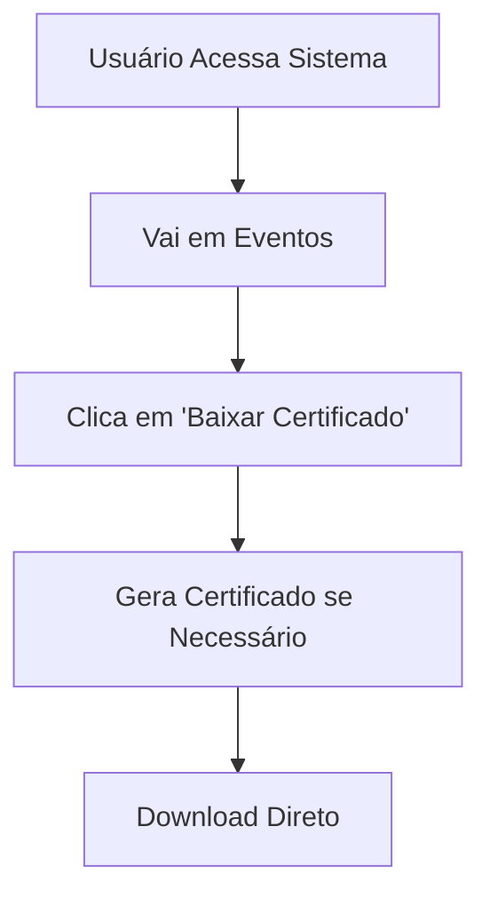

# 🚀 Implementação de Push Automático de Certificados

## 📋 **Resumo da Implementação**

Esta implementação adiciona funcionalidade de **push automático** ao seu sistema de eventos, que:

1. ✅ **Mantém a funcionalidade manual existente** (baixar certificado)
2. ✅ **Adiciona sistema completo de email** com templates profissionais  
3. ✅ **Cria processamento automático** que após finalização do evento:
   - Faz auto-checkout de participantes
   - Gera certificados automaticamente
   - Envia por email (se configurado)
4. ✅ **Permite automação via webhooks/cron jobs**

---

## 🛠️ **Arquivos Criados/Modificados**

### **Novos Arquivos:**

1. **`src/lib/email-service.ts`** - Sistema completo de envio de emails
2. **`src/app/api/auto-process-events/route.ts`** - API de processamento automático
3. **`env.example.local`** - Variáveis de ambiente atualizadas
4. **`IMPLEMENTACAO-PUSH-AUTOMATICO.md`** - Esta documentação

### **Dependências Adicionadas:**
```bash
npm install nodemailer @types/nodemailer
```

---

## ⚙️ **Configuração**

### **1. Variáveis de Ambiente**

Adicione ao seu `.env.local`:

```env
# ===========================================
# CONFIGURAÇÃO DE EMAIL (NOVO)
# ===========================================
EMAIL_USER=seu-email@gmail.com
EMAIL_PASS=sua-senha-de-app-gmail
```

### **2. Configurar Gmail App Password**

⚠️ **ATUALIZADO:** A interface do Google mudou! Siga os passos em `CONFIGURACAO-EMAIL-GMAIL.md`

**Resumo rápido:**
1. Ative **Verificação em duas etapas** primeiro
2. Acesse https://myaccount.google.com/apppasswords  
3. Gere senha para "Sistema de Eventos"
4. Use a senha de 16 caracteres no `EMAIL_PASS`

⚠️ **IMPORTANTE:** Use App Password, não sua senha normal do Gmail!

---

## 🔄 **Como Funciona**

### **Fluxo Automático:**

```mermaid
graph TD
    A[Evento Finaliza] --> B[Chamada Manual/Automática da API]
    B --> C[/api/auto-process-events]
    C --> D[Busca Eventos Finalizados]
    D --> E[Auto-Checkout Participantes]
    E --> F[Gera Certificados PDF]
    F --> G[Upload para Cloudinary]
    G --> H{Email Configurado?}
    H -->|Sim| I[Envia Email com Certificado]
    H -->|Não| J[Apenas Disponibiliza Download]
    I --> K[✅ Concluído]
    J --> K
```

### **Fluxo Manual (Mantido):**



---

## 📡 **APIs Disponíveis**

### **1. Processamento Automático Completo**
```bash
POST /api/auto-process-events
```

**Executa sequencialmente:**
- Auto-checkout de eventos finalizados
- Geração de certificados para quem fez checkout
- Envio por email (se configurado)

**Resposta:**
```json
{
  "success": true,
  "message": "Processamento automático concluído para 2 eventos em 15432ms",
  "eventsProcessed": 2,
  "totalCheckedOut": 45,
  "totalCertificatesGenerated": 45,
  "totalEmailsSent": 45,
  "emailConfigured": true,
  "processedEvents": [
    {
      "eventId": "evt123",
      "eventName": "Workshop React",
      "endTime": "2024-01-15T18:00:00.000Z",
      "checkedOutCount": 23,
      "certificatesGenerated": 23,
      "emailsSent": 23
    }
  ]
}
```

### **2. Health Check**
```bash
GET /api/auto-process-events
```

**Verifica status do serviço:**
```json
{
  "status": "ok",
  "service": "Auto Process Events",
  "timestamp": "2024-01-15T15:30:00.000Z",
  "emailConfigured": true,
  "baseUrl": "https://seu-site.com",
  "endpoints": {
    "process": "https://seu-site.com/api/auto-process-events",
    "manualCheckout": "https://seu-site.com/api/auto-checkout-all",
    "generateCertificate": "https://seu-site.com/api/generate-certificate"
  }
}
```

### **3. APIs Existentes (Mantidas)**
```bash
POST /api/auto-checkout-all      # Auto-checkout apenas
POST /api/auto-checkout         # Auto-checkout evento específico
POST /api/generate-certificate  # Gerar certificado individual
```

---

## 🔧 **Como Automatizar**

### **Opção 1: Webhook (Recomendado)**

Configure um serviço como **Vercel Cron** ou **GitHub Actions**:

```yaml
# .github/workflows/auto-process.yml
name: Auto Process Events
on:
  schedule:
    - cron: '*/30 * * * *'  # A cada 30 minutos

jobs:
  process:
    runs-on: ubuntu-latest
    steps:
      - name: Process Events
        run: |
          curl -X POST https://seu-site.vercel.app/api/auto-process-events \
               -H "Content-Type: application/json"
```

### **Opção 2: Vercel Cron Jobs**

```js
// api/cron/auto-process.js
export default async function handler(req, res) {
  if (req.method !== 'POST') {
    return res.status(405).json({ error: 'Method not allowed' });
  }
  
  // Verificar segurança (opcional)
  const authHeader = req.headers.authorization;
  if (authHeader !== `Bearer ${process.env.CRON_SECRET}`) {
    return res.status(401).json({ error: 'Unauthorized' });
  }
  
  try {
    const response = await fetch(`${process.env.NEXT_PUBLIC_APP_URL}/api/auto-process-events`, {
      method: 'POST',
      headers: { 'Content-Type': 'application/json' }
    });
    
    const result = await response.json();
    res.status(200).json(result);
  } catch (error) {
    res.status(500).json({ error: error.message });
  }
}
```

### **Opção 3: Serviço Externo**

Use **Zapier**, **IFTTT**, ou **n8n** para chamar a API periodicamente.

---

## 📧 **Template de Email**

O sistema envia emails HTML profissionais com:

- ✅ **Design responsivo** e moderno
- ✅ **Botão de download** destacado
- ✅ **Informações do evento** organizadas
- ✅ **Branding** personalizável
- ✅ **Fallback texto** para clientes que não suportam HTML

**Preview do Email:**
```
🎖️ Certificado Disponível!

Olá, João Silva!

Parabéns! Seu certificado de participação já está disponível para download.

📅 Detalhes do Evento:
Evento: Workshop React Avançado
Data: 15 de janeiro de 2024
Participante: João Silva

[📥 Baixar Certificado]

O certificado também permanece disponível em sua conta no sistema 
para futuro download.

Muito obrigado pela sua participação!
```

---

## 🔍 **Logs e Monitoramento**

O sistema gera logs detalhados para monitoramento:

```javascript
// Exemplos de logs gerados:
🚀 Iniciando processamento automático de eventos finalizados
📅 Eventos finalizados encontrados: { count: 2 }
🎯 Processando evento: Workshop React
1️⃣ Executando auto-checkout para evento evt123
📄 Gerando certificado para João Silva
📧 Enviando 23 emails com certificados
✅ Evento processado com sucesso em 15432ms
🎉 Processamento automático concluído com sucesso
```

---

## ✅ **Testes**

### **1. Testar Email**
```bash
# Crie um evento de teste que finalize em alguns minutos
# Execute manualmente:
curl -X POST http://localhost:3000/api/auto-process-events
```

### **2. Verificar Configuração**
```bash
# Health check:
curl http://localhost:3000/api/auto-process-events
```

### **3. Testar sem Email**
- Não configure `EMAIL_USER` e `EMAIL_PASS`
- O sistema funcionará normalmente, apenas não enviará emails
- Certificados ficarão disponíveis para download manual

---

## 🚀 **Vantagens desta Implementação**

### ✅ **Compatibilidade Total**
- Não quebra nada existente
- Funcionalidade manual continua funcionando
- APIs existentes mantidas intactas

### ✅ **Configuração Opcional**
- Sistema funciona com ou sem email
- Degradação graceful se email falhar
- Logs detalhados para debugging

### ✅ **Escalabilidade**
- Processamento em lote eficiente
- Rate limiting integrado
- Cache otimizado

### ✅ **Segurança**
- Sanitização de dados
- Rate limiting
- Logs de auditoria
- Validação de configurações

### ✅ **Profissionalismo**
- Templates de email modernos
- Branding personalizável
- UX consistente

---

## 🔄 **Próximos Passos Sugeridos**

### **Implementação Imediata:**
1. ✅ Configurar variáveis de ambiente
2. ✅ Testar manualmente a API
3. ✅ Configurar automação (webhook/cron)

### **Melhorias Futuras:**
- 📱 **Push notifications** no navegador
- 📊 **Dashboard** de estatísticas de emails
- 🎨 **Templates** de email personalizáveis por evento  
- 📱 **WhatsApp integration** para notificações
- 🔔 **Slack/Discord webhooks** para admins

---

## ❓ **Suporte**

Em caso de problemas:

1. **Verificar logs** no console/Vercel
2. **Testar configuração** com GET `/api/auto-process-events`
3. **Verificar variáveis** de ambiente
4. **Testar email** com serviços de teste

**A implementação está completa e pronta para uso!** 🎉
