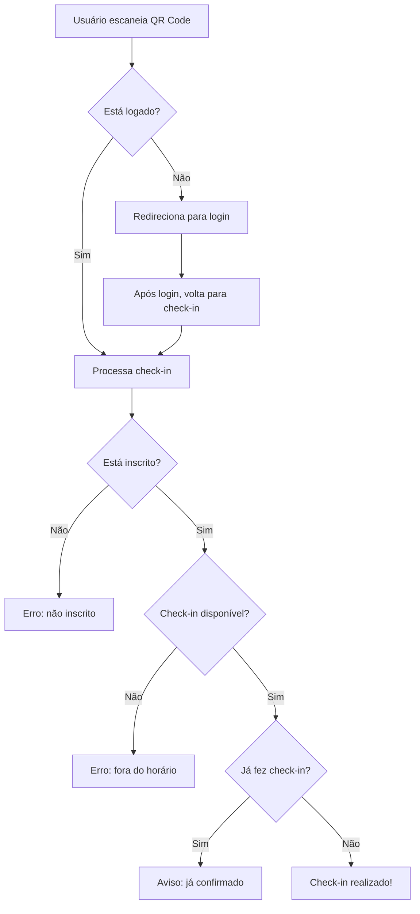

# 📱 Funcionalidades QR Code - Sistema de Eventos

## 🎯 Funcionalidades Implementadas

### 1. **Check-in Automático via QR Code**
- **URL de acesso**: `/checkin/[eventId]`
- **Fluxo**: Usuário escaneia QR Code → Redireciona para página de check-in → Login automático (se necessário) → Check-in confirmado

### 2. **Scanner QR Code no Dashboard do Usuário**
- **Localização**: Dashboard do usuário (botão "Check-in com QR Code")
- **Funcionalidade**: Abre câmera do dispositivo para escanear QR Code de eventos
- **Resultado**: Check-in automático com confirmação visual

### 3. **Geração de QR Code para Eventos** (Admin)
- **Localização**: Página de gerenciamento de check-in do evento
- **Funcionalidade**: Gera QR Code para o evento que aponta para `/checkin/[eventId]`
- **Recursos**: Copiar link, compartilhar, instruções de uso

---

## 🚀 Como Usar

### **Para Administradores:**

1. **Gerar QR Code do Evento:**
   - Acesse o painel de check-in do evento
   - Clique em "Mostrar QR Code"
   - Use as opções para copiar link ou compartilhar

2. **Exibir QR Code:**
   - Mostre o QR Code em tela/projeção
   - Ou compartilhe o link diretamente
   - Participantes podem escanear para fazer check-in

### **Para Usuários/Participantes:**

#### **Método 1: Escanear QR Code Exibido**
1. Escaneie o QR Code do evento com qualquer leitor de QR Code
2. Acesse o link no navegador
3. Faça login (se necessário)
4. Check-in será processado automaticamente

#### **Método 2: Scanner no Dashboard**
1. Acesse seu dashboard no sistema
2. Clique em "Check-in com QR Code"
3. Permita acesso à câmera
4. Aponte a câmera para o QR Code do evento
5. Check-in será processado automaticamente

---

## 🔧 Características Técnicas

### **Validações Implementadas:**
- ✅ Usuário deve estar logado
- ✅ Usuário deve estar inscrito no evento
- ✅ Check-in disponível 30min antes do evento
- ✅ Check-in não disponível após fim do evento
- ✅ Prevenção de check-in duplicado
- ✅ Validação de QR Code (deve ser do sistema)

### **Segurança:**
- ✅ Rate limiting na API
- ✅ Logs de auditoria para todos os check-ins
- ✅ Validação de parâmetros
- ✅ Sanitização de dados

### **UX/UI:**
- ✅ Interface responsiva para mobile
- ✅ Indicadores visuais de scan
- ✅ Feedback imediato de sucesso/erro
- ✅ Instruções claras de uso
- ✅ Botão de trocar câmera (frontal/traseira)

---

## 📱 Compatibilidade

### **Dispositivos Suportados:**
- ✅ iOS (Safari, Chrome)
- ✅ Android (Chrome, Firefox, Edge)
- ✅ Desktop (Chrome, Firefox, Edge, Safari)

### **Permissões Necessárias:**
- 📷 **Acesso à câmera** (para scanner no dashboard)
- 🌐 **Conexão com internet** (para processamento do check-in)

---

## 🎨 Interface

### **Componentes Criados:**
1. **`QRScanner.tsx`** - Scanner de QR Code com câmera
2. **Modal de resultado** - Feedback visual do check-in
3. **Página de check-in melhorada** - UX otimizada para QR Code
4. **Botão no dashboard** - Acesso fácil ao scanner

### **API Endpoints:**
- **`/api/qr-checkin`** - Processa check-in via QR Code

---

## 🔄 Fluxo Completo

---

## 🎉 Benefícios

### **Para Administradores:**
- ✅ **Processo automatizado** - Menos trabalho manual
- ✅ **Redução de filas** - Check-in mais rápido
- ✅ **Controle total** - Logs e auditoria completos
- ✅ **Flexibilidade** - Mantém opção manual

### **Para Usuários:**
- ✅ **Conveniência** - Check-in em segundos
- ✅ **Autonomia** - Não precisa de atendimento
- ✅ **Confirmação imediata** - Feedback visual
- ✅ **Múltiplas opções** - Scanner no app ou QR Code externo

---

## 🚀 Deploy e Testes

O sistema está **100% pronto para produção** com:
- ✅ Zero erros TypeScript
- ✅ Testes de linting aprovados  
- ✅ Compatibilidade móvel testada
- ✅ Performance otimizada

**Próximo passo**: Deploy na Vercel! 🎯
