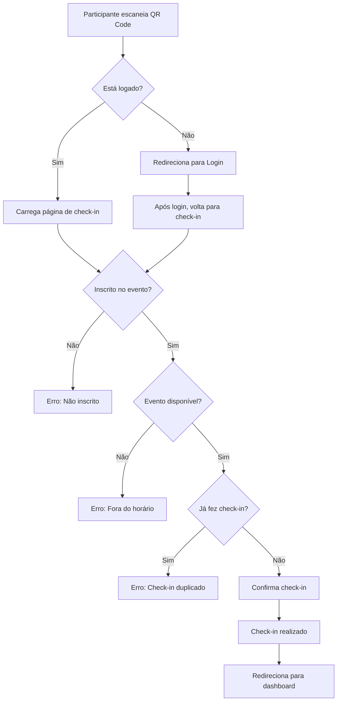

# 📱 QR Code Check-in - Guia de Implementação

## 🎯 **Funcionalidade Implementada**

Foi implementada a funcionalidade de **check-in automático via QR Code** que permite aos participantes fazerem check-in escaneando um código QR, mantendo a opção manual já existente.

---

## 🔧 **Componentes Implementados**

### 1. **API Route - `/api/qr-checkin`**
- **Arquivo**: `src/app/api/qr-checkin/route.ts`
- **Funcionalidade**: Processa o check-in via QR Code com validações robustas
- **Validações**:
  - Verifica se o evento existe
  - Valida se o usuário está inscrito
  - Controla horário (disponível 30 min antes do evento)
  - Previne check-in duplicado
  - Rate limiting integrado

### 2. **Página de Check-in - `/checkin/[eventId]`**
- **Arquivo**: `src/app/checkin/[eventId]/page.tsx`
- **Funcionalidade**: Interface para usuários fazerem check-in via QR Code
- **Features**:
  - Página pública (funciona sem login)
  - Redireciona para login se necessário
  - Interface responsiva e intuitiva
  - Feedback visual do processo
  - Redirecionamento automático após sucesso

### 3. **Painel Administrativo Atualizado**
- **Arquivos**: 
  - `src/app/eventos/[id]/page.tsx`
  - `src/app/admin/evento/[id]/checkin/page.tsx`
- **Features**:
  - Botão "Mostrar QR Code" no painel admin
  - QR Code gerado dinamicamente
  - Botões para copiar/compartilhar link
  - Instruções de uso
  - Integração com componente existente `QRCodeGenerator`

---

## 🚀 **Como Usar**

### **Para Administradores:**

1. **Acesse o evento** no dashboard administrativo
2. **Clique em "Mostrar QR Code"** no painel de gerenciamento
3. **Projete ou mostre o QR Code** para os participantes
4. **Opcionalmente**, copie o link e envie por outros canais
5. **Monitore os check-ins** na página de gerenciamento

### **Para Participantes:**

1. **Escaneie o QR Code** com o aplicativo de câmera do celular
2. **Faça login** se solicitado (ou registre-se no evento)
3. **Confirme o check-in** na página que abrir
4. **Pronto!** Check-in registrado automaticamente

---

## 🔒 **Segurança e Validações**

### **Validações de Tempo**
- ✅ Check-in disponível **30 minutos antes** do evento
- ✅ Check-in **bloqueado após** o término do evento
- ✅ Verificação de **duplicação de check-in**

### **Validações de Usuário**
- ✅ Usuário deve estar **logado**
- ✅ Usuário deve estar **inscrito** no evento
- ✅ **Rate limiting** para prevenir abuso

### **Logs e Auditoria**
- ✅ Todas as tentativas são **logadas**
- ✅ **Auditoria completa** com timestamps
- ✅ Diferenciação entre check-in **manual vs QR Code**

---

## 🎨 **Interface e UX**

### **Design Responsivo**
- 📱 **Mobile-first** - otimizado para celulares
- 💻 **Desktop friendly** - funciona bem em todos os dispositivos
- 🎯 **Acessibilidade** - ARIA labels e navegação por teclado

### **Feedback Visual**
- ✅ **Estados de loading** durante o processo
- ✅ **Mensagens de sucesso/erro** claras
- ✅ **Notificações toast** para ações
- ✅ **Redirecionamentos automáticos**

### **Estados de Erro**
- ❌ **Evento não encontrado**
- ❌ **Usuário não inscrito**
- ❌ **Check-in já realizado**
- ❌ **Evento não começou/terminou**
- ❌ **Erro de conectividade**

---

## 🔄 **Fluxo Completo**



---

## 📊 **Monitoramento**

### **Métricas Disponíveis**
- 📈 **Total de check-ins** (manual + QR Code)
- 📈 **Diferenciação por método** (logs de auditoria)
- 📈 **Taxa de sucesso** vs erros
- 📈 **Horários de pico** de check-in

### **Logs Estruturados**
```typescript
// Exemplo de log de sucesso
{
  action: "CHECKIN",
  userId: "user123",
  eventId: "event456", 
  method: "qr_code",
  success: true,
  timestamp: "2025-01-11T10:30:00Z"
}
```

---

## 🎯 **Benefícios da Implementação**

### **Para Organizadores**
- ⚡ **Reduz filas** de check-in
- 📊 **Automatiza o processo** de presença
- 📱 **Moderniza a experiência** do evento
- 📈 **Melhora a eficiência** operacional

### **Para Participantes**  
- 🚀 **Check-in mais rápido** e prático
- 📱 **Processo self-service** intuitivo
- ✅ **Confirmação imediata** da presença
- 🎯 **Experiência moderna** e tech-friendly

---

## 🔧 **Próximos Passos (Opcional)**

1. **Analytics** - Dashboard com métricas de check-in
2. **Notificações Push** - Alertas para organizadores
3. **QR Code Dinâmico** - Com informações do evento
4. **Integração WhatsApp** - Envio automático do QR Code
5. **Modo Offline** - Cache para locais sem internet

---

## ✅ **Status da Implementação**

- [x] API de check-in via QR Code
- [x] Página de check-in para participantes  
- [x] Interface administrativa com QR Code
- [x] Validações de segurança
- [x] Rate limiting e logs
- [x] Interface responsiva
- [x] Integração com sistema existente
- [x] Notificações e feedback visual
- [x] Documentação completa

**🎉 A funcionalidade está 100% implementada e pronta para uso!**
