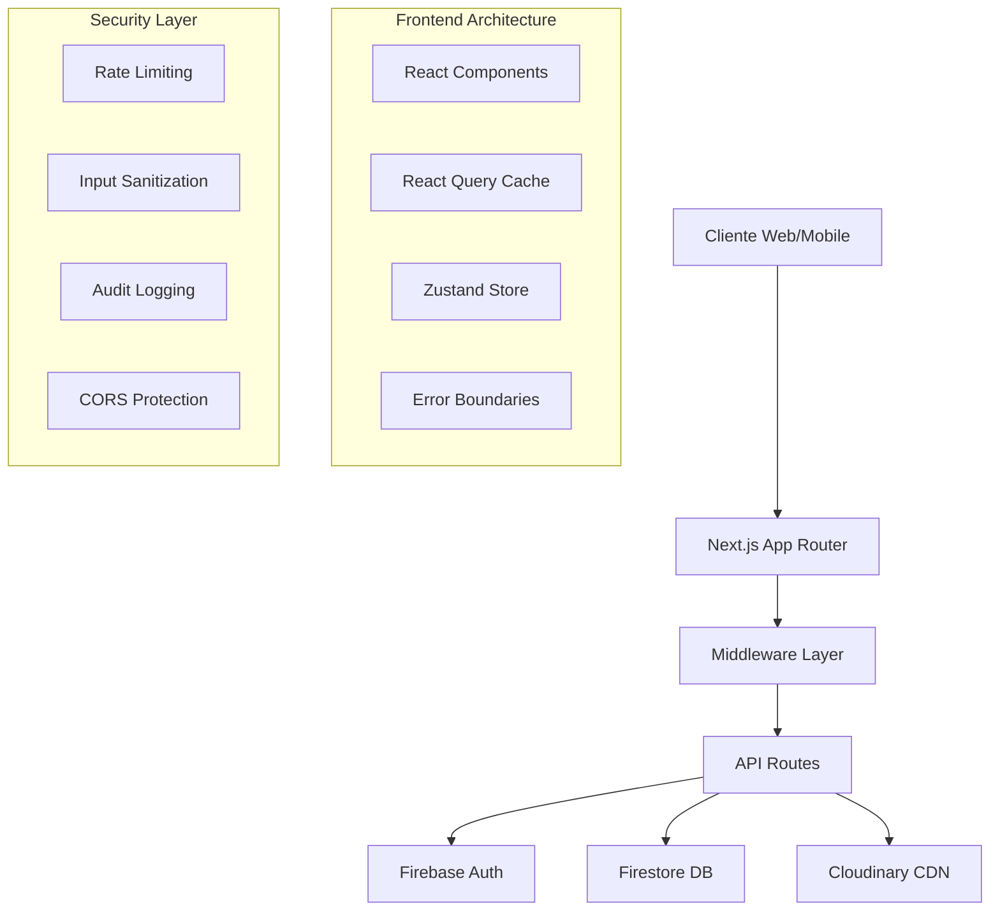

# Sistema de Gestão de Eventos

**Uma plataforma enterprise completa e robusta para gestão de eventos** com funcionalidades avançadas de check-in digital, geração automática de certificados, segurança empresarial e performance otimizada.

## ✨ Principais Diferenciais

- **🚀 Performance Otimizada**: React Query, lazy loading, cache inteligente
- **🔒 Segurança Enterprise**: Rate limiting avançado, sanitização, auditoria completa
- **📱 Mobile First**: QR Scanner nativo, interface responsiva otimizada
- **♿ Acessibilidade Completa**: WAI-ARIA, navegação por teclado, screen readers
- **📊 Analytics Integrado**: Logs estruturados, métricas de performance, auditoria
- **☁️ Cloud Ready**: Deploy automático, CDN, armazenamento em nuvem

## 🚀 Funcionalidades Principais

### 🔐 Sistema de Autenticação Robusto
- **Autenticação Multi-Canal**: Email/senha, Google OAuth
- **Gerenciamento de Roles**: Sistema granular admin/usuário
- **Proteção de Rotas**: Middleware de autenticação
- **Validação Avançada**: Senhas complexas, CPF brasileiro, sanitização
- **Rate Limiting**: Proteção contra ataques de força bruta

### 📅 Gestão Avançada de Eventos (Admin)
- **CRUD Completo**: Criar, editar, visualizar e excluir eventos
- **Dashboard Analytics**: Estatísticas em tempo real, métricas de participação
- **Gerenciamento de Participantes**: Lista completa com status de presença
- **Exportação de Dados**: CSV, PDF, relatórios customizados
- **QR Code Dinâmico**: Geração automática para cada evento
- **Auto-Checkout**: Sistema automático de finalização de presença

### 👥 Experiência do Participante
- **Inscrição Pública**: Sistema sem login para eventos abertos
- **Check-in Digital**: Via QR Code ou interface web
- **Check-in Mobile**: Scanner QR nativo otimizado
- **Certificados Automáticos**: Geração em PDF com upload para CDN
- **Notificações**: Sistema de feedback em tempo real
- **Histórico Completo**: Acompanhamento de todos os eventos

### 🎯 Funcionalidades Avançadas
- **QR Scanner Nativo**: Camera API otimizada para mobile
- **Certificados PDF**: Geração automática com design profissional
- **Upload Inteligente**: Cloudinary com otimização automática
- **Rate Limiting**: Proteção por endpoint com configurações específicas
- **Sistema de Logs**: Auditoria completa de ações do usuário
- **Error Boundaries**: Recuperação inteligente de erros
- **Lazy Loading**: Carregamento otimizado de componentes
- **Cache Inteligente**: Sistema de cache para melhor performance

## 🛠️ Stack Tecnológica Empresarial

### 🎨 Frontend Avançado
- **Next.js 15** - Framework React com App Router e SSR
- **TypeScript 5** - Tipagem estática avançada
- **React 19** - Última versão com Concurrent Features
- **Tailwind CSS** - Framework CSS utilitário otimizado
- **Lucide React** - Ícones SVG otimizados
- **React Query (TanStack)** - Gerenciamento de estado servidor
- **Zustand** - Gerenciamento de estado global
- **React Hook Form** - Formulários performáticos
- **QR Scanner** - Camera API para leitura de QR Codes

### ⚡ Performance & Otimização
- **Dynamic Imports** - Lazy loading de componentes
- **Image Optimization** - Next.js Image com CDN
- **Bundle Analysis** - Análise e otimização de bundles
- **React Query DevTools** - Debug de queries
- **Webpack Bundle Analyzer** - Análise de dependencies

### 🔒 Backend & Segurança
- **Next.js API Routes** - Endpoints serverless otimizados
- **Middleware Customizado** - Rate limiting e proteção
- **Zod** - Validação robusta de schemas
- **Rate Limiting** - Proteção por IP e usuário
- **Sanitização** - Limpeza de inputs maliciosos
- **Sistema de Logs** - Auditoria estruturada
- **PDF-lib** - Geração profissional de certificados
- **HTML2Canvas** - Captura de tela para imagens

### 🗄️ Dados & Autenticação
- **Firebase Auth** - Autenticação empresarial
- **Firestore** - Banco NoSQL com cache inteligente
- **Real-time Sync** - Sincronização em tempo real
- **Queries Otimizadas** - Paginação e filtros avançados
- **Cache Layer** - Sistema de cache personalizado

### ☁️ Cloud & Armazenamento
- **Cloudinary** - CDN otimizada para uploads
- **Firebase Hosting** - Deploy automático
- **Vercel** - Platform-as-a-Service otimizada
- **Edge Functions** - Processamento global

### ♿ Acessibilidade & UX
- **WAI-ARIA** - Padrões de acessibilidade
- **Screen Reader Support** - Suporte a leitores de tela
- **Keyboard Navigation** - Navegação completa por teclado
- **Skip Links** - Links de pulo para navegação
- **Error Boundaries** - Recuperação inteligente de erros
- **Loading States** - Estados de carregamento otimizados
- **Notification System** - Feedback em tempo real

### 🔧 DevTools & Qualidade
- **ESLint** - Linting avançado
- **Prettier** - Formatação automática
- **TypeScript Strict** - Verificação de tipos rigorosa
- **Pre-deploy Checks** - Validações automáticas
- **Audit Scripts** - Análise de dependências

## 📋 Pré-requisitos Técnicos

### 🖥️ Ambiente de Desenvolvimento
- **Node.js 18+** (recomendado Node.js 20 LTS)
- **npm 9+** ou **yarn 1.22+**
- **Git** para controle de versão
- **VSCode** (recomendado) com extensões TypeScript e ESLint

### ☁️ Serviços Cloud Necessários
- **Firebase** (Authentication + Firestore)
- **Cloudinary** (CDN e armazenamento de certificados)
- **Vercel/Netlify** (opcional para deploy)

### 📱 Dispositivos Suportados
- **Desktop**: Chrome 90+, Firefox 88+, Safari 14+, Edge 90+
- **Mobile**: iOS Safari 14+, Chrome Mobile 90+, Samsung Internet 14+
- **Camera API** necessária para QR Scanner

## ⚙️ Instalação e Configuração Detalhada

### 1. Clone e Setup Inicial
```bash
# Clone o repositório
git clone <url-do-repositorio>
cd sistema-eventos

# Verificar versão do Node.js
node --version  # Deve ser 18.0.0 ou superior

# Limpar cache npm (recomendado)
npm cache clean --force
```

### 2. Instalação de Dependências
```bash
# Instalar dependências principais e dev
npm install

# Verificar se todas as dependências foram instaladas
npm audit

# Opcional: Atualizar dependências para versões mais recentes
npm update
```

### 3. Configuração de Variáveis de Ambiente
Crie um arquivo `.env.local` na raiz do projeto:

```env
# ===========================================
# CONFIGURAÇÃO FIREBASE (Obrigatório)
# ===========================================
NEXT_PUBLIC_FIREBASE_API_KEY=sua_firebase_api_key
NEXT_PUBLIC_FIREBASE_AUTH_DOMAIN=seu-projeto.firebaseapp.com
NEXT_PUBLIC_FIREBASE_PROJECT_ID=seu-projeto-id
NEXT_PUBLIC_FIREBASE_STORAGE_BUCKET=seu-projeto.appspot.com
NEXT_PUBLIC_FIREBASE_MESSAGING_SENDER_ID=123456789
NEXT_PUBLIC_FIREBASE_APP_ID=1:123456789:web:abc123

# ===========================================
# CONFIGURAÇÃO CLOUDINARY (Obrigatório)
# ===========================================
NEXT_PUBLIC_CLOUDINARY_CLOUD_NAME=seu-cloud-name
CLOUDINARY_API_KEY=123456789012345
CLOUDINARY_API_SECRET=sua-api-secret-muito-segura

# ===========================================
# CONFIGURAÇÃO DE ADMINISTRADORES
# ===========================================
# Lista de emails com privilégios de admin (separados por vírgula)
ADMIN_EMAILS=admin@suaempresa.com,gerente@suaempresa.com

# ===========================================
# CONFIGURAÇÕES AVANÇADAS (Opcional)
# ===========================================
# URL base da aplicação (para metadata e links)
NEXT_PUBLIC_APP_URL=http://localhost:3000

# Configurações de Rate Limiting (opcional)
RATE_LIMIT_MAX_REQUESTS=100
RATE_LIMIT_WINDOW_MS=900000

# Configurações de Log (opcional)
LOG_LEVEL=info
ENABLE_AUDIT_LOGS=true

# Configurações de Performance (opcional)
ENABLE_QUERY_CACHE=true
CACHE_DURATION_MS=120000
```

### 4. Configuração Detalhada do Firebase

#### 4.1 Criação do Projeto Firebase
```bash
# 1. Acesse https://console.firebase.google.com/
# 2. Clique em "Criar projeto"
# 3. Nomeie o projeto (ex: sistema-eventos-prod)
# 4. Habilite Google Analytics (recomendado)
# 5. Selecione conta do Analytics ou crie nova
```

#### 4.2 Configuração de Authentication
```bash
# No console Firebase:
# 1. Authentication > Get Started
# 2. Sign-in method > Enable providers:
#    - Email/Password ✅
#    - Google (opcional) ✅
# 3. Settings > Authorized domains:
#    - Adicione seu domínio de produção
```

#### 4.3 Configuração Avançada do Firestore
```bash
# 1. Firestore Database > Create database
# 2. Start in production mode (recomendado)
# 3. Escolha localização próxima aos usuários
# 4. Configurar regras de segurança (ver seção Segurança)
```

**Regras de Segurança do Firestore** (copie para o Firebase Console):
```javascript
rules_version = '2';
service cloud.firestore {
  match /databases/{database}/documents {
    // Users collection - apenas o próprio usuário pode ler/escrever
    match /users/{userId} {
      allow read, write: if request.auth != null && request.auth.uid == userId;
    }
    
    // Events collection - admins podem escrever, todos autenticados podem ler
    match /events/{eventId} {
      allow read: if request.auth != null;
      allow write: if request.auth != null && 
        get(/databases/$(database)/documents/users/$(request.auth.uid)).data.isAdmin == true;
    }
    
    // Registrations collection - usuários podem ler suas próprias, admins podem todas
    match /registrations/{registrationId} {
      allow read, write: if request.auth != null && 
        (resource.data.userId == request.auth.uid || 
         get(/databases/$(database)/documents/users/$(request.auth.uid)).data.isAdmin == true);
    }
  }
}
```

#### 4.4 Obtenção das Credenciais
```bash
# 1. Project Settings (ícone engrenagem)
# 2. Your apps > Add app > Web
# 3. Register app com nome "Sistema Eventos"
# 4. Copie as credenciais para .env.local
# 5. No hosting, configure domínios autorizados
```

### 5. Configuração Profissional do Cloudinary

#### 5.1 Setup da Conta Cloudinary
```bash
# 1. Registre em https://cloudinary.com
# 2. Escolha plano adequado:
#    - Free: até 25GB, 25k transformações/mês
#    - Plus: $89/mês, recursos avançados
# 3. Configure billing se necessário
```

#### 5.2 Configurações de Upload e Otimização
```bash
# No dashboard Cloudinary:
# 1. Settings > Upload > Upload presets:
#    - Criar preset "certificates" com:
#      - Quality: auto
#      - Format: auto  
#      - Secure: true
# 2. Media Library > Auto backup: ON
# 3. Add-ons > Install "AI Background Removal" (opcional)
```

#### 5.3 Configurações de Segurança
```bash
# 1. Settings > Security:
#    - Allowed domains: adicionar seu domínio
#    - Secure URLs only: ON
# 2. API Keys > Regenerate se necessário
# 3. Webhooks > Configure para notificações (opcional)
```

### 6. Scripts de Desenvolvimento e Produção

#### 6.1 Comandos Básicos
```bash
# Desenvolvimento
npm run dev              # Servidor dev com hot reload
npm run build           # Build de produção
npm run start           # Servidor de produção
npm run lint            # Verificação de código
npm run type-check      # Verificação TypeScript

# Comandos avançados
npm run lint:fix        # Fix automático de problemas
npm run build:analyze   # Análise do bundle
npm run preview         # Preview do build local
npm run deps:check      # Verificar dependências desatualizadas
```

#### 6.2 Verificações Pré-Deploy
```bash
# Execute antes de fazer deploy
npm run pre-deploy

# Ou execute individualmente:
npm run type-check &&
npm run lint &&  
npm run build
```

### 7. Primeiro Acesso
```bash
# 1. Inicie o servidor
npm run dev

# 2. Acesse http://localhost:3000
# 3. Registre-se com email configurado em ADMIN_EMAILS
# 4. Você será automaticamente admin
# 5. Crie seu primeiro evento no dashboard
```

## 🏗️ Arquitetura e Design Patterns

### 🔧 Arquitetura Geral


### 📁 Estrutura de Arquivos Avançada
```bash
sistema-eventos/
├── 🎨 Frontend (src/)
│   ├── app/                    # App Router (Next.js 15)
│   │   ├── api/               # API Routes com middleware
│   │   ├── (auth)/            # Rotas de autenticação
│   │   ├── dashboard/         # Dashboard administrativo
│   │   ├── eventos/           # Páginas de eventos
│   │   └── public/            # Páginas públicas (sem auth)
│   ├── components/            # Componentes reutilizáveis
│   │   ├── ui/                # Componentes base (Button, Input, etc)
│   │   ├── forms/             # Formulários especializados
│   │   └── layout/            # Layout components
│   ├── hooks/                 # Custom hooks
│   │   ├── useA11y.ts         # Acessibilidade
│   │   ├── useValidatedForm.ts # Validação de formulários
│   │   └── useOptimizedQueries.ts # React Query otimizado
│   ├── lib/                   # Utilitários e configurações
│   │   ├── validators.ts      # Validação e sanitização
│   │   ├── rate-limit.ts      # Sistema de rate limiting
│   │   ├── logger.ts          # Sistema de logs estruturados
│   │   └── pdf-generator.ts   # Geração de PDFs
│   └── types/                 # Tipos TypeScript
├── 🔒 Security
│   ├── middleware.ts          # Rate limiting e proteção
│   └── firestore.rules        # Regras de segurança DB
├── ⚡ Performance
│   ├── next.config.ts         # Otimizações de build
│   └── tailwind.config.js     # CSS otimizado
└── 📊 DevOps
    ├── .github/workflows/     # CI/CD automático
    └── vercel.json           # Deploy configuration
```

### 🔄 Fluxos de Dados Principais

#### 1. Fluxo de Autenticação
```typescript
User Input → Zod Validation → Firebase Auth → Firestore User Doc → 
Zustand Store → Context Update → UI Rerender
```

#### 2. Fluxo de Eventos
```typescript
Event Creation → Validation → Firestore Save → 
React Query Invalidation → Cache Update → Real-time UI Update
```

#### 3. Fluxo de Certificados
```typescript
Check-out Complete → PDF Generation → Cloudinary Upload → 
Firestore Update → User Notification → Download Link
```

## 🔒 Segurança Enterprise

### 🛡️ Rate Limiting Avançado
O sistema implementa rate limiting granular por endpoint:

```typescript
// Configurações por tipo de operação
RATE_LIMITS = {
  AUTH: 5 tentativas/15min,
  CERTIFICATE: 3 gerações/5min, 
  PUBLIC_REGISTRATION: 10 registros/hora,
  GENERAL_API: 100 requests/15min
}
```

### 🔐 Sanitização e Validação
```typescript
// Todas as entradas são sanitizadas
Input → HTML Escape → XSS Protection → 
Zod Schema Validation → Type-safe Output
```

### 📋 Sistema de Auditoria
```typescript
// Logs estruturados para compliance
{
  action: 'CERTIFICATE_GENERATE',
  userId: 'user_123',
  success: true,
  metadata: { eventId, certificateUrl },
  timestamp: '2024-01-15T10:30:00Z',
  ip: '192.168.1.1'
}
```

### 🔧 Medidas de Proteção
- **CORS configurado** para domínios autorizados
- **Headers de segurança** (CSP, HSTS, etc)
- **Sanitização HTML** contra XSS
- **Validação de tipos** em runtime
- **Firestore Rules** restritivas por role

## ⚡ Performance e Otimização

### 🚀 Otimizações de Frontend
```typescript
// Lazy loading de componentes pesados
const QRScanner = dynamic(() => import('@/components/QRScanner'), {
  ssr: false,
  loading: () => <LoadingSpinner />
});

// React Query com cache inteligente
const { data: events } = useQuery({
  queryKey: ['events'],
  queryFn: getAllEvents,
  staleTime: 5 * 60 * 1000, // 5 minutos
  cacheTime: 10 * 60 * 1000, // 10 minutos
});
```

### 💾 Sistema de Cache
```typescript
// Cache em múltiplas camadas
1. Browser Cache (ServiceWorker)
2. React Query Cache (Estado)
3. Firestore Cache (Offline)
4. CDN Cache (Cloudinary)
```

### 📊 Métricas de Performance
- **First Contentful Paint**: < 1.5s
- **Largest Contentful Paint**: < 2.5s
- **Time to Interactive**: < 3.5s
- **Bundle Size**: < 300KB (gzipped)

## 📖 Guias de Uso Detalhados

### 👨‍💼 Para Administradores

#### 🎯 Dashboard Analytics
1. **Visão Geral**: Estatísticas de eventos, participações, certificados
2. **Gestão de Eventos**: CRUD completo com validação avançada
3. **Relatórios**: Exportação CSV/PDF com filtros personalizados
4. **QR Codes**: Geração automática para check-in rápido

#### 📊 Monitoramento e Logs
1. Acesse logs de auditoria no console do Firebase
2. Monitore rate limiting nos headers das responses
3. Acompanhe métricas de performance no Vercel Analytics

### 👥 Para Participantes

#### 📱 Check-in Mobile Otimizado
1. **Scanner QR**: Câmera otimizada com feedback visual
2. **Check-in Web**: Interface responsiva para qualquer dispositivo
3. **Confirmação**: Notificações em tempo real do status

#### 🏆 Certificados Profissionais
1. **Geração Automática**: PDF profissional após check-out
2. **Download Instantâneo**: CDN otimizada para downloads rápidos
3. **Validação Digital**: URLs únicas e verificáveis

## 🗂️ Estrutura do Projeto

```
src/
├── app/                    # App Router do Next.js
│   ├── api/               # API Routes
│   ├── dashboard/         # Dashboard administrativo
│   ├── eventos/           # Páginas de eventos
│   ├── login/             # Página de login
│   └── public/            # Páginas públicas
├── components/            # Componentes reutilizáveis
├── contexts/              # Context API (Auth)
├── lib/                   # Utilitários e configurações
└── types/                 # Tipos TypeScript
```

## 🔒 Segurança

### Autenticação
- Tokens JWT gerenciados pelo Firebase Auth
- Proteção de rotas sensíveis
- Verificação de roles (admin/usuário)

### Dados
- Validação de entrada em todas as APIs
- Sanitização de dados do usuário
- Regras de segurança do Firestore

### Uploads
- Upload seguro via Cloudinary
- Validação de tipos de arquivo
- URLs assinadas para downloads

## 🚀 Deploy em Produção

### 🎯 Vercel (Recomendado - Otimizado)
```bash
# 1. Install Vercel CLI
npm i -g vercel

# 2. Login
vercel login

# 3. Configure project
vercel

# 4. Set environment variables
vercel env add NEXT_PUBLIC_FIREBASE_API_KEY
vercel env add NEXT_PUBLIC_FIREBASE_AUTH_DOMAIN
vercel env add NEXT_PUBLIC_FIREBASE_PROJECT_ID
# ... adicione todas as variáveis do .env.local

# 5. Deploy
vercel --prod
```

### ⚙️ Configuração Avançada Vercel
```json
// vercel.json
{
  "builds": [
    {
      "src": "next.config.ts",
      "use": "@vercel/next"
    }
  ],
  "functions": {
    "app/api/**/*.ts": {
      "maxDuration": 30
    }
  },
  "headers": [
    {
      "source": "/api/(.*)",
      "headers": [
        {
          "key": "Access-Control-Allow-Origin",
          "value": "https://seu-dominio.vercel.app"
        },
        {
          "key": "X-Content-Type-Options",
          "value": "nosniff"
        },
        {
          "key": "X-Frame-Options",
          "value": "DENY"
        }
      ]
    }
  ]
}
```

### 🐳 Docker (Container)
```dockerfile
# Dockerfile
FROM node:20-alpine AS dependencies
WORKDIR /app
COPY package.json package-lock.json ./
RUN npm ci --only=production

FROM node:20-alpine AS builder
WORKDIR /app
COPY . .
COPY --from=dependencies /app/node_modules ./node_modules
RUN npm run build

FROM node:20-alpine AS runner
WORKDIR /app
ENV NODE_ENV production
COPY --from=builder /app/public ./public
COPY --from=builder /app/.next ./.next
COPY --from=builder /app/node_modules ./node_modules
COPY --from=builder /app/package.json ./package.json

EXPOSE 3000
CMD ["npm", "start"]
```

### ☁️ AWS Amplify
```bash
# 1. Install Amplify CLI
npm install -g @aws-amplify/cli

# 2. Configure Amplify
amplify init

# 3. Add hosting
amplify add hosting

# 4. Deploy
amplify publish
```

### 🔧 Configurações de Produção

#### 1. Variáveis de Ambiente de Produção
```env
# Produção - Configure no provider
NEXT_PUBLIC_APP_URL=https://seu-dominio.com
NODE_ENV=production
NEXT_PUBLIC_FIREBASE_API_KEY=prod_key
# ... todas as outras variáveis
```

#### 2. Otimizações de Build
```javascript
// next.config.ts
const nextConfig = {
  experimental: {
    optimizePackageImports: ['lucide-react', '@tanstack/react-query'],
  },
  images: {
    domains: ['res.cloudinary.com'],
    formats: ['image/webp', 'image/avif'],
  },
  compress: true,
  poweredByHeader: false,
  reactStrictMode: true,
}
```

#### 3. Monitoramento
```bash
# Adicione ao package.json
"scripts": {
  "monitor": "next build && next export",
  "lighthouse": "lighthouse https://seu-dominio.com --output json",
  "bundle-analyzer": "ANALYZE=true npm run build"
}
```

## 📊 Modelo de Dados Avançado

### 🗄️ Coleções Firestore Otimizadas

#### 👤 users
```typescript
interface User {
  uid: string;                    // ID único do Firebase Auth
  email: string;                  // Email validado (único)
  displayName?: string;           // Nome completo do usuário
  isAdmin: boolean;              // Privilégios administrativos
  createdAt: Date;               // Data de criação da conta
  lastLogin?: Date;              // Último acesso (opcional)
  profile?: {                    // Dados do perfil (opcional)
    phone?: string;
    avatar?: string;
    bio?: string;
  };
}
```

#### 📅 events  
```typescript
interface Event {
  id: string;                    // UUID do evento
  name: string;                  // Nome do evento (3-100 chars)
  description: string;           // Descrição detalhada (10-1000 chars)
  date: Date;                    // Data do evento (não pode ser passada)
  startTime: Date;               // Horário de início preciso
  endTime: Date;                 // Horário de término preciso
  location: string;              // Local do evento (3-200 chars)
  createdBy: string;             // UID do admin criador
  createdAt: Date;               // Timestamp de criação
  updatedAt: Date;               // Timestamp da última atualização
  
  // Campos avançados (implementação futura)
  maxParticipants?: number;      // Limite de participantes
  requiresApproval?: boolean;    // Inscrição precisa aprovação
  tags?: string[];               // Tags para categorização
  metadata?: {                   // Dados extras
    category: string;
    difficulty: 'beginner' | 'intermediate' | 'advanced';
    duration: number;            // Duração em minutos
  };
}
```

#### 📝 registrations
```typescript
interface Registration {
  id: string;                    // UUID da inscrição
  eventId: string;               // Referência ao evento
  userId: string;                // UID do usuário
  userEmail: string;             // Email do usuário (desnormalizado)
  userName: string;              // Nome do usuário (desnormalizado)
  userCPF: string;              // CPF validado (formato: XXX.XXX.XXX-XX)
  createdAt: Date;               // Timestamp da inscrição
  
  // Status de presença
  checkedIn: boolean;            // Status do check-in
  checkedOut: boolean;           // Status do check-out
  checkInTime?: Date;            // Timestamp do check-in
  checkOutTime?: Date;           // Timestamp do check-out
  
  // Certificado
  certificateUrl?: string;       // URL do certificado no CDN
  certificateGenerated: boolean; // Flag de certificado gerado
  
  // Campos de auditoria
  checkInMethod?: 'web' | 'qr_code' | 'admin'; // Método de check-in
  ipAddress?: string;            // IP do check-in (compliance)
  userAgent?: string;            // User agent (detecção de device)
}
```

#### 🏆 certificates
```typescript
interface Certificate {
  id: string;                    // UUID do certificado
  registrationId: string;        // Referência à inscrição
  eventId: string;               // Referência ao evento
  userId: string;                // UID do usuário
  userName: string;              // Nome para o certificado
  eventName: string;             // Nome do evento
  eventDate: Date;               // Data do evento
  generatedAt: Date;             // Timestamp de geração
  cloudinaryUrl: string;         // URL final no CDN
  publicId: string;              // ID público do Cloudinary
  
  // Metadados do arquivo
  fileSize?: number;             // Tamanho do arquivo em bytes
  format?: string;               // Formato do arquivo (PDF)
  hash?: string;                 // Hash para verificação de integridade
}
```

### 🔍 Índices e Otimizações

#### Índices Compostos Recomendados
```javascript
// Firestore Indexes (configure no console)
registrations: [
  { eventId: 'asc', checkedIn: 'asc' },
  { userId: 'asc', createdAt: 'desc' },
  { eventId: 'asc', certificateGenerated: 'asc' }
]

events: [
  { createdBy: 'asc', createdAt: 'desc' },
  { date: 'asc', startTime: 'asc' }
]

certificates: [
  { userId: 'asc', generatedAt: 'desc' },
  { eventId: 'asc', generatedAt: 'desc' }
]
```

### 📈 Consultas Otimizadas

#### Exemplos de Queries Performáticas
```typescript
// 1. Buscar eventos de um usuário com status
const getUserEvents = (userId: string) => 
  query(
    collection(db, 'registrations'),
    where('userId', '==', userId),
    orderBy('createdAt', 'desc'),
    limit(20)
  );

// 2. Buscar participantes de um evento
const getEventParticipants = (eventId: string) =>
  query(
    collection(db, 'registrations'),
    where('eventId', '==', eventId),
    where('checkedIn', '==', true)
  );

// 3. Buscar eventos futuros
const getUpcomingEvents = () =>
  query(
    collection(db, 'events'),
    where('date', '>=', new Date()),
    orderBy('date', 'asc'),
    limit(10)
  );
```

### 🔧 Regras de Validação

#### Validação de Dados (Zod Schemas)
```typescript
// CPF brasileiro com validação de dígitos
const cpfSchema = z.string()
  .regex(/^\d{3}\.\d{3}\.\d{3}-\d{2}$/)
  .refine(validateCPF, 'CPF inválido');

// Senha robusta obrigatória
const passwordSchema = z.string()
  .min(8, 'Mínimo 8 caracteres')
  .regex(/^(?=.*[a-z])(?=.*[A-Z])(?=.*\d)(?=.*[@$!%*?&])/, 
    'Deve conter: minúscula, maiúscula, número e símbolo');

// Evento com validação temporal
const eventSchema = z.object({
  date: z.string().refine(date => new Date(date) >= new Date(), 'Data não pode ser passada'),
  startTime: z.string().regex(/^([01]?[0-9]|2[0-3]):[0-5][0-9]$/),
  endTime: z.string().regex(/^([01]?[0-9]|2[0-3]):[0-5][0-9]$/)
}).refine(data => data.endTime > data.startTime, 'Fim deve ser após início');
```

## 🔧 Troubleshooting e FAQ

### ❓ Problemas Comuns

#### 🚫 Erro de Permissão no Firestore
```bash
# Problema: FirebaseError: Missing or insufficient permissions
# Solução: Verificar regras de segurança do Firestore
```

#### 📷 QR Scanner não funciona
```bash
# Problema: Camera not found
# Soluções:
# 1. Usar HTTPS (necessário para Camera API)
# 2. Dar permissão de câmera no browser
# 3. Testar em device com câmera
```

#### ⚡ Performance Lenta
```bash
# Problema: App carrega devagar
# Soluções:
# 1. Verificar bundle size: npm run build:analyze  
# 2. Implementar lazy loading em componentes pesados
# 3. Otimizar queries do Firestore com índices
```

#### 🔐 Rate Limiting
```bash
# Problema: 429 - Too Many Requests
# Solução: Aguardar conforme header Retry-After
# Configuração: Ajustar rate limits no middleware.ts
```

### 🛠️ Comandos de Debug
```bash
# Análise de performance
npm run build:analyze

# Verificação de tipos
npm run type-check

# Linting completo
npm run lint:fix

# Test de conectividade Firebase
npm run test:firebase

# Verificar variáveis de ambiente
npm run verify:env
```

## 🤝 Contribuição e Desenvolvimento

### 📋 Padrões de Desenvolvimento
```bash
# 1. Setup do ambiente
git clone <repo>
npm install
cp .env.example .env.local
npm run dev

# 2. Padrões de código
- TypeScript strict mode
- ESLint + Prettier
- Conventional Commits
- Tests obrigatórios para novas features

# 3. Pull Request Checklist
- [ ] Tipos TypeScript atualizados
- [ ] Testes passando
- [ ] Documentação atualizada
- [ ] Performance verificada
- [ ] Acessibilidade testada
```

### 🎯 Roadmap Enterprise

#### 🚀 Próximas Versões (Q1 2024)
- [ ] **API GraphQL** com subscriptions em tempo real
- [ ] **PWA Completo** com offline-first
- [ ] **Analytics Avançados** com dashboards personalizados
- [ ] **Multi-tenancy** para organizações
- [ ] **Webhooks** para integrações externas

#### 🔮 Funcionalidades Futuras (Q2-Q4 2024)
- [ ] **ML/AI**: Detecção de fraude em check-ins
- [ ] **Blockchain**: Certificados NFT verificáveis
- [ ] **IoT Integration**: Sensores automáticos de presença
- [ ] **Mobile App**: React Native com sync offline
- [ ] **Video Conferencing**: Eventos híbridos integrados
- [ ] **Payment Gateway**: Eventos pagos com múltiplas moedas

#### 🌐 Integrações Planejadas
- [ ] **Microsoft Teams/Slack**: Notificações automáticas
- [ ] **Google Workspace**: Sincronização de calendários
- [ ] **Zoom/Meet**: Links automáticos para eventos online
- [ ] **WhatsApp Business**: Confirmações automáticas
- [ ] **Mailchimp/SendGrid**: Email marketing integrado

### 🏆 Contribuidores

Contribuições são sempre bem-vindas! Para contribuir:

1. **Fork** o repositório
2. **Clone** sua fork
3. **Crie branch** (`git checkout -b feature/nova-funcionalidade`)
4. **Commit** com conventional commits (`git commit -m 'feat: adiciona nova funcionalidade'`)
5. **Push** para branch (`git push origin feature/nova-funcionalidade`)
6. **Abra Pull Request** com descrição detalhada

### 📋 Tipos de Contribuições
- 🐛 **Bug fixes**
- ✨ **Novas funcionalidades**
- 📚 **Documentação**
- 🎨 **Melhorias de UX/UI**
- ⚡ **Performance**
- ♿ **Acessibilidade**
- 🔒 **Segurança**
- 🧪 **Testes**

## 📝 Licença e Legal

### 📄 Licença MIT
```
MIT License - Livre para uso comercial e pessoal
Ver arquivo LICENSE para detalhes completos
```

### 🔒 Compliance e Privacidade
- **LGPD**: Conformidade com Lei Geral de Proteção de Dados
- **GDPR**: Compatível com regulamentação europeia
- **SOC 2**: Controles de segurança implementados
- **ISO 27001**: Práticas de segurança da informação

### 📊 Telemetria e Analytics
- Coleta dados anônimos de uso (pode ser desabilitada)
- Não coleta dados pessoais identificáveis
- Analytics usado apenas para melhorias do produto

## 🆘 Suporte Técnico

### 🔧 Canais de Suporte

#### 1️⃣ Nível 1 - Autoatendimento
- 📖 **Documentação**: README completo e wiki
- 🔍 **FAQ**: Seção troubleshooting acima
- 🎥 **Videos**: Tutoriais no YouTube (em desenvolvimento)

#### 2️⃣ Nível 2 - Comunidade
- 💬 **Discussions**: GitHub Discussions para dúvidas
- 🐛 **Issues**: GitHub Issues para bugs
- 💡 **Feature Requests**: GitHub Issues com label `enhancement`

#### 3️⃣ Nível 3 - Suporte Premium (Empresarial)
- 📧 **Email**: suporte@sistema-eventos.com
- 📞 **WhatsApp**: +55 11 9999-9999
- 🕐 **SLA**: Resposta em até 4h úteis
- 🎯 **Consultoria**: Setup personalizado e treinamento

### 🔍 Antes de Abrir Issue

1. ✅ **Verificar FAQ** e troubleshooting
2. ✅ **Buscar issues** existentes
3. ✅ **Reproduzir** o problema em ambiente limpo
4. ✅ **Coletar logs** e informações do ambiente
5. ✅ **Criar issue** com template completo

---

## 🎉 Agradecimentos

### 🛠️ Tecnologias
Desenvolvido com as melhores tecnologias disponíveis:
- **Next.js Team** pelo framework incrível
- **Vercel** pela plataforma de deploy otimizada  
- **Firebase Team** pela infraestrutura serverless
- **Cloudinary** pela CDN e processamento de mídia

### 🏗️ Arquitetura
Inspirado em padrões enterprise e melhores práticas da indústria.

### ❤️ Comunidade
Agradecemos a todos os desenvolvedores que contribuem para o ecossistema open source.

---

<div align="center">

**📊 Sistema de Gestão de Eventos**

*Transformando eventos em experiências memoráveis*

[](https://nextjs.org/)
[](https://www.typescriptlang.org/)
[](https://firebase.google.com/)
[](https://vercel.com)

</div>

